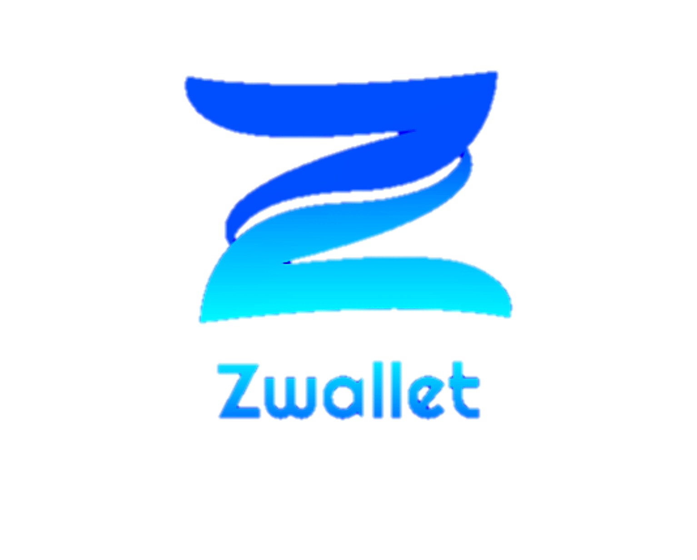

<h1 align="center">Zwallet - Backend</h1>
<p align="center">
  
</p>


Zwallet-Backend is a backend for Zwallet application. Built with NodeJs using the ExpressJs Framework.
Express.js is a web application framework for Node.js. [More about Express](https://en.wikipedia.org/wiki/Express.js)
## Built With
[](https://expressjs.com/en/starter/installing.html)
[](https://nodejs.org/)

## Requirements
1. <a href="https://nodejs.org/en/download/">Node Js</a>
2. <a href="https://www.getpostman.com/">Postman</a>
3. [Xampp](https://www.apachefriends.org/download.html)

## How to run the app ?
1. Open app's directory in CMD or Terminal
2. Type 
```npm install```
3. Make new file a called **.env**, set up first [here](#set-env)
4. Turn on Apache and MYSQL Server using xampp, etc.
5. Create a database with the name **zwallet** 
6. Create folder uploads on directory root
6. Open Postman desktop application or Chrome web app extension that has installed before
7. Choose HTTP Method and enter request url.
8. You can see all the end point [here](#api-request-example)


### set .env
```
DB_HOST=
PORT=
DB_DATABASE=
DB_USERNAME=
DB_PASSWORD=

BASE_URL = [Backend Deploy]
SECRET_KEY = 

EMAIL = 
PW_EMAIL = 
```

### Compiles and hot-reloads for development
```
npm run dev
```

## Install Redis On linux
```
https://redis.io/download
```


## Install Redis On Windows
```
https://github.com/tporadowski/redis
```

## API Request Example 

[](https://app.getpostman.com/run-collection/95accfab92ed0867b22e)

## Related Project

- [Zwallet Frontend](https://github.com/FendiAnwarRifai/Zwallet-Frontend)

<!-- CONTACT -->
## Contact

- Email - fendianwar36@gmail.com
- LinkedIn - [Fendi Anwar Rifa'i](https://www.linkedin.com/in/fendi-anwar-rifai/)


